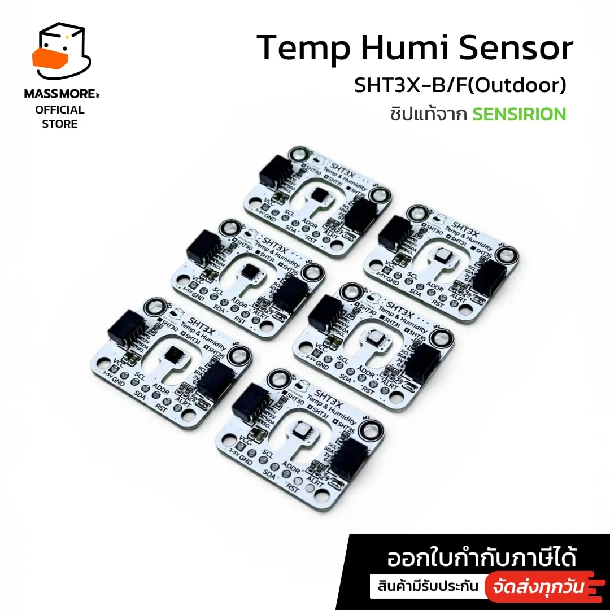
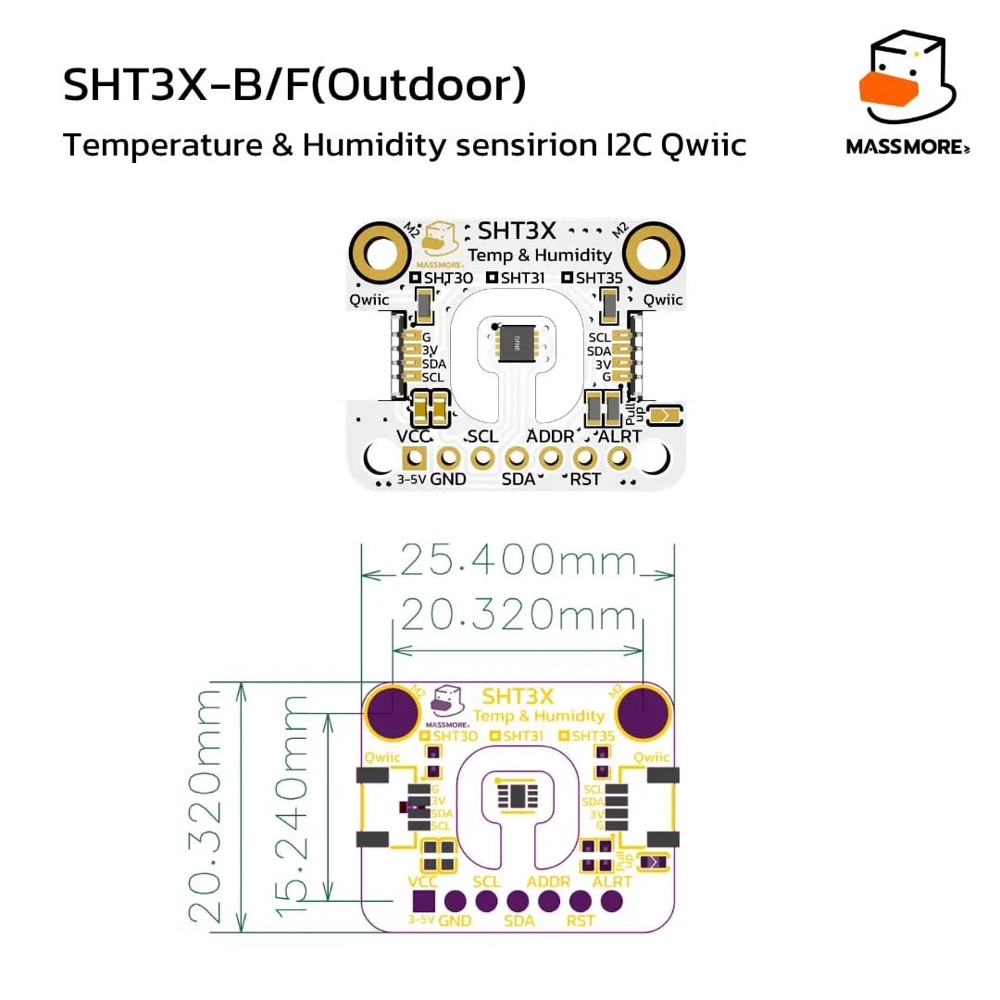
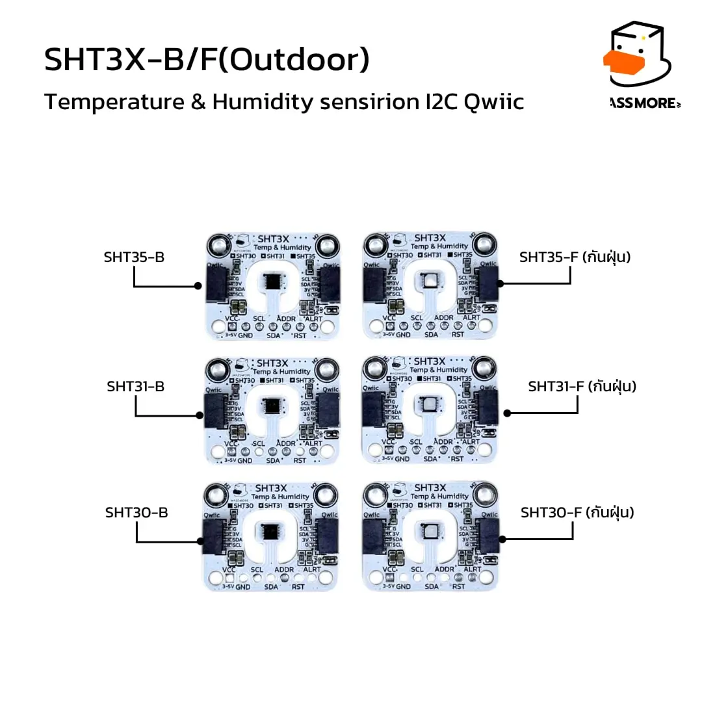
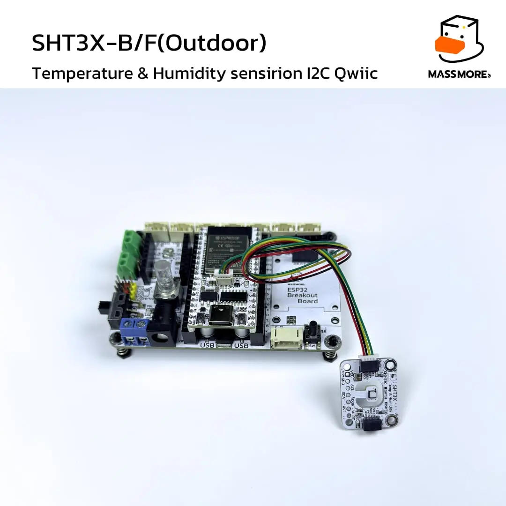
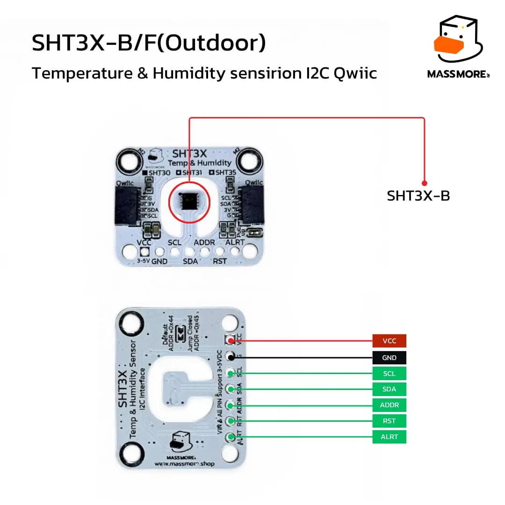
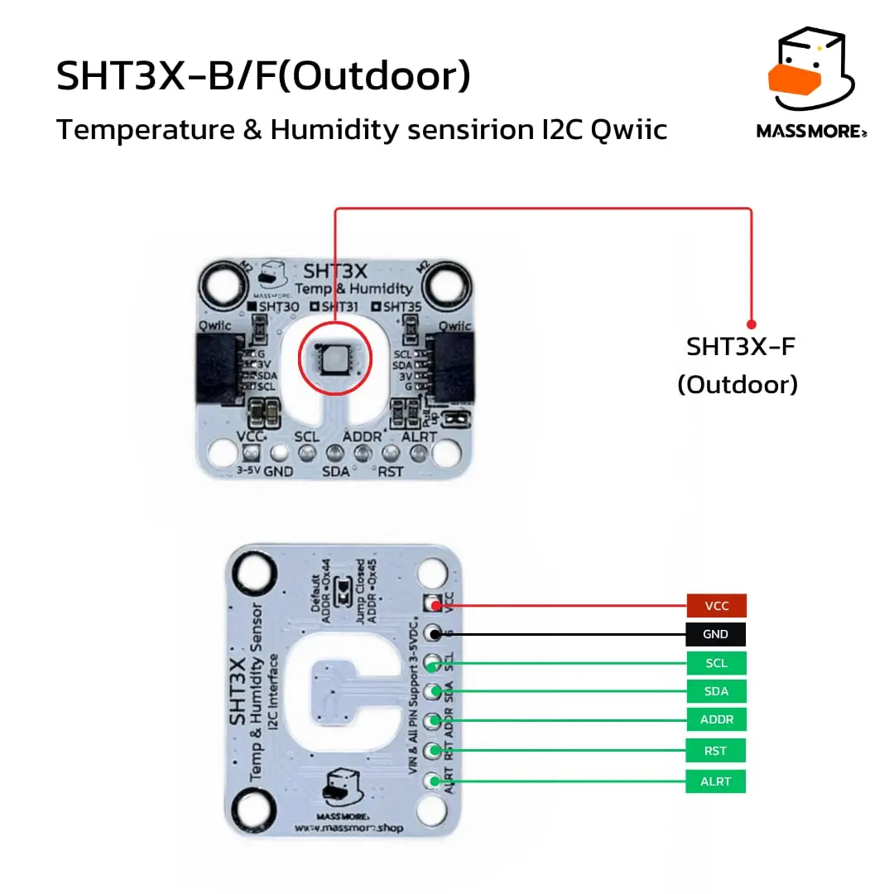

<div align="center">



# Massmore SHT3x

**ไลบรารี Arduino / PlatformIO สำหรับเซ็นเซอร์อุณหภูมิและความชื้น Sensirion SHT3x-DIS**

รองรับ SHT30 · SHT31 · SHT35 ทั้งรุ่นปกติ (`-B`) และรุ่นกันฝุ่นกันน้ำ (`-F` Outdoor)

[](LICENSE)
[](CHANGELOG.md)
[](#ติดตั้งบน-arduino-ide)
[](#ติดตั้งบน-vs-code--platformio)

**SKU-1022** · [ดูสินค้าที่ร้าน Massmore](https://www.massmore.shop/products/f9e65fad-f86d-4ac3-9e95-6f575e1d33d3)

</div>

---

## สารบัญ

- [ไลบรารีนี้ต่างจากตัวอื่นอย่างไร](#ไลบรารีนี้ต่างจากตัวอื่นอย่างไร)
- [สเปกโดยย่อ](#สเปกโดยย่อ)
- [รุ่นในตระกูล SHT3x](#รุ่นในตระกูล-sht3x)
- [การต่อสาย](#การต่อสาย)
- [ติดตั้ง](#ติดตั้ง)
- [เริ่มใช้งานใน 10 บรรทัด](#เริ่มใช้งานใน-10-บรรทัด)
- [ตัวอย่างทั้งหมด](#ตัวอย่างทั้งหมด)
- [คู่มือ API](#คู่มือ-api)
- [ตรวจสอบว่าเป็นชิปแท้](#ตรวจสอบว่าเป็นชิปแท้)
- [เฟิร์มแวร์ Factory Test](#เฟิร์มแวร์-factory-test)
- [แก้ปัญหาที่พบบ่อย](#แก้ปัญหาที่พบบ่อย)
- [การทดสอบไลบรารี](#การทดสอบไลบรารี)
- [โครงสร้างโฟลเดอร์](#โครงสร้างโฟลเดอร์)
- [เอกสารอ้างอิง](#เอกสารอ้างอิง)

---

## ไลบรารีนี้ต่างจากตัวอื่นอย่างไร

| หัวข้อ | ไลบรารีนี้ |
|---|---|
| **ที่มาของข้อมูล** | เขียนจาก [Datasheet SHT3x-DIS](https://sensirion.com/media/documents/213E6A3B/63A5A569/Datasheet_SHT3x_DIS.pdf) และ Application Note เรื่อง Alert Mode โดยตรง ทุกค่าคงที่มีที่มาระบุไว้ในโค้ด |
| **ความครบของฟังก์ชัน** | ครบทุกคำสั่งที่ชิปมี ตั้งแต่ single shot จนถึง ALERT threshold ทั้ง 4 ชุด และซีเรียลจากโรงงาน |
| **หน่วยความจำ** | ไม่ใช้ heap เลย ไม่มี `new` / `malloc` / `String` ในส่วนแกน กินแรมประมาณ 60 ไบต์ต่ออ็อบเจกต์ |
| **โหมดไม่บล็อก** | มีทั้งแบบ non-blocking single shot และ `update()` สำหรับ periodic |
| **ตรวจของแท้** | `verifyChip()` ทดสอบพฤติกรรม 10 ข้อว่าเป็นชิป Sensirion จริงหรือของเลียนแบบ |
| **การรายงานข้อผิดพลาด** | แยกรหัสข้อผิดพลาด 11 แบบ พร้อมคำอธิบายภาษาไทย ไม่ใช่แค่คืน `false` |
| **ทดสอบแล้ว** | ชุดทดสอบ 186 ข้อที่รันบน PC ได้โดยไม่ต้องมีบอร์ด + คอมไพล์ผ่านทุกตัวอย่าง 0 warning |
| **เอกสารในโค้ด** | คอมเมนต์ภาษาไทยทุกฟังก์ชัน อธิบายว่าทำอะไรและควรใช้เมื่อไร |

---

## สเปกโดยย่อ

<div align="center">

</div>

| รายการ | ค่า |
|---|---|
| ชิป | Sensirion SHT3x-DIS (SHT30 / SHT31 / SHT35) |
| อินเทอร์เฟซ | I²C มาตรฐาน 0 – 1000 kHz (แนะนำ 100 kHz) |
| I²C address | `0x44` (ปกติ) หรือ `0x45` (บัดกรีจัมเปอร์ ADDR) |
| แรงดันใช้งานบอร์ด | 3 – 5 VDC (บนบอร์ดมี regulator และ level shifter ให้แล้ว) |
| ช่วงอุณหภูมิ | −40 ถึง +125 °C |
| ช่วงความชื้น | 0 – 100 %RH |
| ความละเอียดผลลัพธ์ | 16 บิต ทั้งอุณหภูมิและความชื้น |
| อัตราการวัดสูงสุด | 10 ครั้ง/วินาที |
| กระแสตอนไม่วัด | 0.2 – 2 µA (single shot) · 45 µA (periodic) |
| ขนาดบอร์ด | 25.40 × 20.32 mm · รูยึด M2 |
| คอนเนกเตอร์ | Qwiic / STEMMA QT สองฝั่ง ต่อพ่วงได้ |

---

## รุ่นในตระกูล SHT3x

<div align="center">

</div>

### ต่างกันที่ความแม่นยำ

| รุ่น | ความคลาดเคลื่อนความชื้น | ความคลาดเคลื่อนอุณหภูมิ | เหมาะกับ |
|---|---|---|---|
| **SHT30** | ±2.0 %RH | ±0.2 °C | งานทั่วไป งานอดิเรก IoT ในบ้าน |
| **SHT31** | ±2.0 %RH | ±0.2 °C (ช่วงกว้างกว่า) | งานอุตสาหกรรมเบา ตู้ควบคุม เกษตร |
| **SHT35** | ±1.5 %RH | ±0.1 °C | ห้องแล็บ ห้องคลีนรูม งานสอบเทียบ |

### ต่างกันที่ตัวถัง

| แบบ | ลักษณะ | ใช้ที่ไหน |
|---|---|---|
| **-B** | ตัวถังเปิด ตอบสนองเร็วที่สุด | ในอาคาร ในตู้ ที่ไม่มีฝุ่นหรือละอองน้ำ |
| **-F (Outdoor)** | มีเมมเบรน PTFE กันฝุ่นกันละอองน้ำครอบไว้ | กลางแจ้ง โรงเรือน ห้องเย็น ที่มีไอน้ำหรือฝุ่น |

> **เรื่องที่ต้องพูดตรง ๆ**
> SHT30 · SHT31 · SHT35 คือซิลิคอนตัวเดียวกัน ต่างกันเฉพาะเกรดความแม่นยำที่โรงงาน
> คัดไว้ (binning) ตัวชิป **ไม่มีรีจิสเตอร์บอกรุ่น** จึงอ่านแยกรุ่นผ่าน I²C ไม่ได้เลย
> ไม่ว่าจะใช้ไลบรารีของใครก็ตาม
>
> ให้ดูช่องติ๊กบนซิลค์สกรีนของบอร์ด แล้วบอกไลบรารีเองผ่าน `begin()` หรือ `setVariant()`
> ค่านี้ใช้กำหนดเกณฑ์ความแม่นยำที่รายงานและใช้ตรวจสอบเท่านั้น ไม่มีผลต่อการสื่อสารกับชิป

---

## การต่อสาย

<div align="center">

</div>

### ต่อกับ ESP32

| ขาบนบอร์ด SHT3X | ต่อไปที่ ESP32 | จำเป็นไหม |
|---|---|---|
| `VCC` | 3V3 หรือ 5V | **จำเป็น** |
| `GND` | GND | **จำเป็น** |
| `SDA` | GPIO 21 | **จำเป็น** |
| `SCL` | GPIO 22 | **จำเป็น** |
| `ADDR` | ปล่อยลอย = `0x44` | ไม่จำเป็น |
| `ALRT` | GPIO 4 (ตัวอย่างที่ 07) | เฉพาะเมื่อใช้ ALERT |
| `RST` | GPIO 5 (ตัวอย่างที่ 13) | เฉพาะเมื่อต้องการ hard reset |

หรือใช้สาย Qwiic เสียบเข้าคอนเนกเตอร์ตรง ๆ ได้เลย ไม่ต้องบัดกรี

### แผนผังขา

<table>
<tr>
<td align="center"><b>SHT3X-B (รุ่นปกติ)</b></td>
<td align="center"><b>SHT3X-F (รุ่นกันฝุ่น Outdoor)</b></td>
</tr>
<tr>
<td></td>
<td></td>
</tr>
</table>

### การเปลี่ยน address

| จัมเปอร์ `ADDR` ด้านหลังบอร์ด | I²C address |
|---|---|
| เปิดไว้ (ค่าจากโรงงาน) | `0x44` |
| บัดกรีเชื่อมให้ปิด | `0x45` |

ใช้เมื่อต้องการเซ็นเซอร์สองตัวบนบัสเดียวกัน ดูตัวอย่างที่ [09_MultipleSensors](ArduinoIDE/Massmore_SHT3x/examples/09_MultipleSensors)

---

## ติดตั้ง

รีโปนี้แยกเป็นสองโฟลเดอร์ **เลือกใช้ตามเครื่องมือที่ถนัด ไม่ต้องใช้ทั้งคู่**

```
ArduinoIDE/    ->  สำหรับคนใช้ Arduino IDE
PlatformIO/    ->  สำหรับคนใช้ VS Code + PlatformIO
```

ทั้งสองโฟลเดอร์มีซอร์สของไลบรารีตัวเดียวกันทุกบรรทัด และมีตัวอย่างครบ 15 ชุดเท่ากัน

### ติดตั้งบน Arduino IDE

รองรับ **ESP32 core 3.x** รุ่นล่าสุด (และใช้ได้กับบอร์ดอื่นที่มี `Wire`)

**วิธีที่ 1 – ติดตั้งจากไฟล์ ZIP**

1. ดาวน์โหลดรีโปนี้เป็น ZIP แล้วแตกไฟล์
2. บีบอัดโฟลเดอร์ `ArduinoIDE/Massmore_SHT3x` ให้เป็น `Massmore_SHT3x.zip`
3. ใน Arduino IDE เลือก **Sketch → Include Library → Add .ZIP Library…**
4. เลือกไฟล์ ZIP ที่เพิ่งบีบอัด

**วิธีที่ 2 – คัดลอกโฟลเดอร์เอง**

คัดลอกโฟลเดอร์ `ArduinoIDE/Massmore_SHT3x` ทั้งอันไปวางที่

| ระบบปฏิบัติการ | ตำแหน่ง |
|---|---|
| macOS | `~/Documents/Arduino/libraries/` |
| Windows | `Documents\Arduino\libraries\` |
| Linux | `~/Arduino/libraries/` |

แล้วปิดเปิด Arduino IDE ใหม่ ตัวอย่างจะขึ้นที่ **File → Examples → Massmore_SHT3x**

### ติดตั้งบน VS Code + PlatformIO

เปิดโฟลเดอร์ `PlatformIO/` ด้วย VS Code ได้เลย ไลบรารีอยู่ใน `lib/` แล้ว PlatformIO
จะหาเจอเองโดยไม่ต้องตั้งค่าอะไรเพิ่ม

```bash
git clone https://github.com/Massmore/Massmore_SHT3x_SKU-1022.git
code Massmore_SHT3x_SKU-1022/PlatformIO
```

เลือกตัวอย่างที่ต้องการจาก `examples/` แล้วคัดลอกทับ `src/main.cpp` จากนั้นกด Upload

```bash
cp examples/01_BasicReading/main.cpp src/main.cpp
pio run -t upload -t monitor
```

`platformio.ini` ตั้งค่าไว้ให้แล้ว

```ini
platform = https://github.com/pioarduino/platform-espressif32/releases/download/55.03.311/platform-espressif32.zip
framework = arduino
upload_speed = 512000
monitor_speed = 115200
```

> **ทำไมไม่ใช้ `platform = espressif32` เฉย ๆ**
> platform ตัวทางการของ PlatformIO ยังส่ง Arduino core 2.0.x อยู่ ซึ่งเก่ากว่าที่ Arduino IDE
> ให้มาแล้ว ไลบรารีนี้จึง pin ไปที่ [pioarduino](https://github.com/pioarduino/platform-espressif32)
> เวอร์ชัน `55.03.311` ซึ่งให้ **Arduino ESP32 core 3.3.11** ตรงกับ Arduino IDE
> และทำให้ผลการ build ซ้ำได้เหมือนเดิมทุกครั้ง

บอร์ดที่เตรียม env ไว้ให้แล้ว: `esp32dev` · `esp32-s3-devkitc-1` · `esp32-s2-saola-1` · `esp32-c3-devkitm-1` · `esp32-c6-devkitc-1`

---

## เริ่มใช้งานใน 10 บรรทัด

```cpp
#include <Massmore_SHT3x.h>

MassmoreSHT3x sht;

void setup() {
  Serial.begin(115200);
  // 0x44 = ADDR ปล่อยลอย, SHT31 = รุ่นที่ติ๊กบนบอร์ด, 21/22 = ขา SDA/SCL
  sht.begin(MASSMORE_SHT3X_I2C_ADDR_A, MASSMORE_SHT3X_VARIANT_SHT31, 21, 22);
}

void loop() {
  float t, h;
  if (sht.measure(&t, &h)) {
    Serial.printf("%.2f C  %.2f %%RH\n", t, h);
  }
  delay(1000);
}
```

---

## ตัวอย่างทั้งหมด

เรียงจากง่ายไปยาก ตัวอย่างสุดท้ายคือชุดทดสอบโรงงาน

| # | ชื่อ | สิ่งที่ได้เรียนรู้ |
|:-:|---|---|
| 01 | [BasicReading](ArduinoIDE/Massmore_SHT3x/examples/01_BasicReading) | อ่านอุณหภูมิและความชื้นแบบสั้นที่สุด |
| 02 | [Repeatability](ArduinoIDE/Massmore_SHT3x/examples/02_Repeatability) | เทียบความละเอียดสามระดับ วัดเวลาและ noise จริง |
| 03 | [PeriodicMode](ArduinoIDE/Massmore_SHT3x/examples/03_PeriodicMode) | ให้ชิปวัดเองต่อเนื่อง ใช้ callback รับค่า |
| 04 | [ART_Mode](ArduinoIDE/Massmore_SHT3x/examples/04_ART_Mode) | โหมดตอบสนองเร็ว พร้อมจับเวลาตอนหายใจรด |
| 05 | [Heater](ArduinoIDE/Massmore_SHT3x/examples/05_Heater) | ฮีตเตอร์ในตัว ไล่ความชื้นและตรวจสภาพเซ็นเซอร์ |
| 06 | [StatusRegister](ArduinoIDE/Massmore_SHT3x/examples/06_StatusRegister) | ถอด status register ทีละบิต จับกรณีชิปรีบูตเอง |
| 07 | [AlertMode](ArduinoIDE/Massmore_SHT3x/examples/07_AlertMode) | ตั้ง threshold ให้ชิปเตือนผ่านขา ALRT + interrupt |
| 08 | [SerialNumber_Genuine](ArduinoIDE/Massmore_SHT3x/examples/08_SerialNumber_Genuine) | อ่านซีเรียลโรงงาน และตรวจว่าเป็นชิปแท้ 10 ข้อ |
| 09 | [MultipleSensors](ArduinoIDE/Massmore_SHT3x/examples/09_MultipleSensors) | สองตัวบนบัสเดียว + ตัวที่สามบนบัสที่สอง |
| 10 | [DewPoint_Comfort](ArduinoIDE/Massmore_SHT3x/examples/10_DewPoint_Comfort) | จุดน้ำค้าง ความชื้นสัมบูรณ์ ดัชนีความร้อน |
| 11 | [NonBlocking](ArduinoIDE/Massmore_SHT3x/examples/11_NonBlocking) | วัดโดยไม่บล็อก loop() พร้อมวัดรอบต่อวินาที |
| 12 | [LowPower_DeepSleep](ArduinoIDE/Massmore_SHT3x/examples/12_LowPower_DeepSleep) | วัดแล้วหลับ เก็บประวัติไว้ใน RTC memory |
| 13 | [ErrorHandling](ArduinoIDE/Massmore_SHT3x/examples/13_ErrorHandling) | กู้คืนอัตโนมัติ 4 ชั้น เมื่อสายหลุดหรือไฟตก |
| 14 | [DataLogger_Advanced](ArduinoIDE/Massmore_SHT3x/examples/14_DataLogger_Advanced) | ตัวกรอง min/max ตัด spike ส่งออก CSV |
| 15 | [FactoryTest](ArduinoIDE/Massmore_SHT3x/examples/15_FactoryTest) | **ชุดทดสอบโรงงาน 2 ด่าน + 25 หัวข้อ** |

ฝั่ง PlatformIO มีไฟล์ `main.cpp` ของทุกตัวอย่างอยู่ที่ [`PlatformIO/examples/`](PlatformIO/examples) เนื้อหาเหมือนกันทุกบรรทัด ต่างแค่บรรทัด `#include <Arduino.h>`

---

## คู่มือ API

### เริ่มต้นใช้งาน

```cpp
MassmoreSHT3x sht;                    // ใช้บัส Wire
MassmoreSHT3x sht2(&Wire1);           // ใช้บัส Wire1

sht.begin(address, variant, sda, scl, freq);   // ไลบรารีเปิด Wire ให้
sht.beginWithExistingBus(address, variant);    // เราเปิด Wire เอง
sht.isConnected();                             // ชิปยังตอบอยู่ไหม
MassmoreSHT3x::scan(&Wire, found);             // สแกนหา 0x44 / 0x45
```

### การวัด

| กลุ่ม | ฟังก์ชัน |
|---|---|
| **บล็อก** | `measure(&t, &h)` · `measure(reading)` · `readTemperature()` · `readTemperatureF()` · `readHumidity()` |
| **ไม่บล็อก** | `startMeasurement()` · `isMeasurementReady()` · `readMeasurement(&t, &h)` |
| **ต่อเนื่อง** | `startPeriodic(rate, rep)` · `startART()` · `fetchData(&t, &h)` · `update()` · `stopPeriodic()` |
| **ค่าล่าสุด** | `getTemperature()` · `getHumidity()` · `getRawTemperature()` · `getRawHumidity()` · `getLastReading()` · `getLastUpdateMs()` |

```cpp
// เลือกความละเอียด: LOW (~4 ms) / MEDIUM (~6 ms) / HIGH (~15 ms)
sht.setRepeatability(MASSMORE_SHT3X_REPEATABILITY_HIGH);

// เลือกอัตรา periodic: 0.5 / 1 / 2 / 4 / 10 ครั้งต่อวินาที
sht.startPeriodic(MASSMORE_SHT3X_RATE_2_HZ);

// ใน loop() เรียก update() ถี่แค่ไหนก็ได้ ไลบรารีคุมจังหวะเอง
void loop() { sht.update(); }

// หรือใช้ callback
sht.setCallback([](const massmore_sht3x_reading_t &r) {
  Serial.println(r.temperature);
});
```

### ฮีตเตอร์และ status register

```cpp
sht.heaterOn();  sht.heaterOff();  sht.isHeaterOn();
sht.runHeaterSelfTest(3000, 0.5f, &rise);   // เปิด 3 วิ อุณหภูมิต้องขึ้น 0.5 องศา

massmore_sht3x_status_bits_t bits;
sht.readStatus(bits);
if (bits.resetDetected) { /* ชิปรีบูตเอง ต้องตั้งค่าใหม่ */ }
sht.clearStatus();
```

| ฟิลด์ | บิต | ความหมาย |
|---|:-:|---|
| `alertPending` | 15 | มี alert ค้างอยู่ |
| `heaterOn` | 13 | ฮีตเตอร์เปิดอยู่ |
| `humidityAlert` | 11 | ความชื้นเลยขอบเขต |
| `temperatureAlert` | 10 | อุณหภูมิเลยขอบเขต |
| `resetDetected` | 4 | ชิปเพิ่งรีเซ็ตหรือเพิ่งจ่ายไฟ |
| `commandFailed` | 1 | คำสั่งล่าสุดไม่ถูกประมวลผล |
| `checksumFailed` | 0 | checksum ของข้อมูลที่เขียนไปผิด |

### ALERT

```cpp
sht.setAlertPin(4);

// แบบง่าย: บอกแค่ขอบบน-ล่าง ไลบรารีเว้น hysteresis ให้
sht.setAlertWindow(20.0f, 30.0f,    // อุณหภูมิ ต่ำสุด/สูงสุด
                   40.0f, 70.0f,    // ความชื้น ต่ำสุด/สูงสุด
                   1.0f, 3.0f);     // hysteresis

// แบบละเอียด: ตั้งครบทั้ง 4 ชุดเอง
massmore_sht3x_alert_limits_t limits = { /* ... */ };
sht.setAlertLimits(limits);
sht.getAlertLimits(limits);

sht.startPeriodic(MASSMORE_SHT3X_RATE_1_HZ);   // ALERT ทำงานเฉพาะโหมด periodic
sht.isAlertPinActive();
```

> ชิปเก็บ threshold ได้ความละเอียดประมาณ **0.5 °C** และ **1 %RH** เท่านั้น
> (เก็บแค่ 9 บิตบนของอุณหภูมิ และ 7 บิตบนของความชื้น) ค่าที่อ่านกลับมาจึงอาจไม่เท่ากับที่เขียนไปเป๊ะ

### ตัวตนของชิป

```cpp
uint32_t serial;
sht.readSerialNumber(&serial);       // คำสั่ง 0x3780

massmore_sht3x_genuine_t v = sht.verifyChip();
sht.getVerifyMask();                 // ผ่านข้อไหนบ้าง
sht.getVerifyPassCount();            // ผ่านกี่ข้อจาก 10
MassmoreSHT3x::getVerifyCheckName(i);
MassmoreSHT3x::genuineToString(v);
```

### ค่าที่คำนวณต่อ (เรียกได้โดยไม่ต้องมีอ็อบเจกต์)

```cpp
MassmoreSHT3x::dewPoint(t, h);                 // จุดน้ำค้าง (Magnus) °C
MassmoreSHT3x::absoluteHumidity(t, h);         // ความชื้นสัมบูรณ์ g/m³
MassmoreSHT3x::heatIndex(t, h);                // ดัชนีความร้อน (NOAA) °C
MassmoreSHT3x::saturationVaporPressure(t);     // ความดันไออิ่มตัว hPa
MassmoreSHT3x::celsiusToFahrenheit(t);
```

### รีเซ็ตและการชดเชย

```cpp
sht.softReset();          // คำสั่ง 0x30A2
sht.generalCallReset();   // รีเซ็ตทุกตัวบนบัส (ระวังอุปกรณ์อื่น)
sht.setResetPin(5);
sht.hardReset();          // กระตุกขา RST

sht.setTemperatureOffset(-2.5f);   // ชดเชยกรณีติดใกล้แหล่งความร้อน
sht.setHumidityOffset(1.0f);
```

### การรายงานข้อผิดพลาด

```cpp
if (!sht.measure(&t, &h)) {
  Serial.println(sht.lastErrorString());   // ข้อความภาษาไทย
  switch (sht.lastError()) {
    case MASSMORE_SHT3X_ERR_CRC:       /* สัญญาณรบกวน สายยาวเกิน */ break;
    case MASSMORE_SHT3X_ERR_NO_DEVICE: /* สายหลุด */                break;
    case MASSMORE_SHT3X_ERR_NOT_READY: /* ปกติในโหมด periodic */    break;
    default: break;
  }
}
```

| รหัส | ความหมาย |
|---|---|
| `MASSMORE_SHT3X_OK` | ปกติ |
| `MASSMORE_SHT3X_ERR_NOT_BEGUN` | ยังไม่ได้เรียก `begin()` |
| `MASSMORE_SHT3X_ERR_NO_DEVICE` | ไม่มีอุปกรณ์ตอบที่ address นี้ |
| `MASSMORE_SHT3X_ERR_I2C_WRITE` | เขียนลงบัสไม่สำเร็จ |
| `MASSMORE_SHT3X_ERR_I2C_READ` | อ่านได้ไบต์ไม่ครบ |
| `MASSMORE_SHT3X_ERR_CRC` | checksum ไม่ตรง |
| `MASSMORE_SHT3X_ERR_TIMEOUT` | รอเกินเวลาที่ตั้งไว้ |
| `MASSMORE_SHT3X_ERR_NOT_READY` | ยังไม่มีผลวัดใหม่ (ปกติในโหมด periodic) |
| `MASSMORE_SHT3X_ERR_WRONG_MODE` | เรียกใช้ผิดโหมด |
| `MASSMORE_SHT3X_ERR_BAD_ARG` | พารามิเตอร์ไม่ถูกต้อง |
| `MASSMORE_SHT3X_ERR_OUT_OF_RANGE` | ค่าที่ได้อยู่นอกช่วงที่คาดไว้ |

---

## ตรวจสอบว่าเป็นชิปแท้

ในตลาดมีบอร์ดที่เขียนว่า SHT3x แต่ข้างในเป็นชิปอื่นราคาถูกกว่า ที่ตอบคำสั่งวัดได้เหมือนกัน
แต่พอเจอคำสั่งลึก ๆ ของ Sensirion จะตอบไม่ถูก `verifyChip()` ทดสอบพฤติกรรม 10 ข้อดังนี้

| # | ข้อทดสอบ | ของเลียนแบบมักตกข้อไหน |
|:-:|---|---|
| 1 | ตอบ ACK ที่ address | – |
| 2 | CRC ของ status register ถูกต้อง | บางตัวไม่ส่ง CRC เลย |
| 3 | บิต reserved เป็นศูนย์ตาม datasheet | ✗ ตัวที่ไม่ใช่ SHT3x จะยัดค่าอื่นมา |
| 4 | หลัง soft reset ธง reset ต้องขึ้น | ✗ |
| 5 | สั่ง clear status แล้วธงต้องหาย | ✗ |
| 6 | อ่านซีเรียลด้วยคำสั่ง `0x3780` ได้ | ✗ ตกข้อนี้บ่อยที่สุด |
| 7 | สั่งฮีตเตอร์แล้วบิต 13 ขยับจริง | ✗ |
| 8 | CRC ของผลวัดทั้งสอง word ถูก | – |
| 9 | ค่าที่วัดได้อยู่ในช่วงที่เป็นไปได้ | – |
| 10 | ส่งคำสั่งมั่วแล้วธง command failed ขึ้น | ✗ |

```
ผ่านครบ 10 ข้อ   ->  MASSMORE_SHT3X_GENUINE_PASS       ของแท้
ผ่าน 8-9 ข้อ     ->  MASSMORE_SHT3X_GENUINE_PARTIAL    น่าจะแท้ แต่สัญญาณอาจไม่นิ่ง
ผ่านน้อยกว่า 8   ->  MASSMORE_SHT3X_GENUINE_SUSPECT    น่าสงสัย
ข้อ 2 หรือ 3 ตก  ->  MASSMORE_SHT3X_GENUINE_NOT_SHT3X  ไม่ใช่ SHT3x แน่นอน
```

> **ขอบเขตของการตรวจนี้**
> นี่คือการตรวจ **เชิงพฤติกรรมระดับโปรโตคอล** ไม่ใช่ลายเซ็นดิจิทัล
> ตอบได้ว่า *"ชิปตัวนี้ทำตัวเหมือน SHT3x แท้ทุกประการหรือไม่"* ซึ่งเพียงพอสำหรับ
> คัดของเลียนแบบที่พบในตลาด แต่ไม่ใช่การยืนยันตัวตนแบบเข้ารหัส
>
> บอร์ด Massmore ใช้ **ชิปแท้จาก Sensirion** ประกอบในประเทศไทย

ดูตัวอย่างเต็มที่ [08_SerialNumber_Genuine](ArduinoIDE/Massmore_SHT3x/examples/08_SerialNumber_Genuine)

---

## เฟิร์มแวร์ Factory Test

มีไฟล์ `.bin` พร้อมแฟลชอยู่ในโฟลเดอร์ [`firmware/`](firmware) ใช้ตรวจบอร์ดว่าทำงานครบ
โดยไม่ต้องคอมไพล์เอง อัปโหลดแล้วเปิด Serial Monitor ที่ 115200 ได้ผลทันที

รายละเอียดการใช้งาน วิธีแฟลช และการแก้ปัญหา อยู่ที่ **[firmware/README.md](firmware/README.md)**

---

## แก้ปัญหาที่พบบ่อย

<details>
<summary><b>begin() คืน false / หาเซ็นเซอร์ไม่เจอ</b></summary>

1. ตรวจว่าต่อ `VCC` และ `GND` ครบ และ GND ร่วมกันกับ ESP32
2. `SDA` กับ `SCL` สลับกันหรือเปล่า ลองสลับดู
3. ถ้าบัดกรีจัมเปอร์ `ADDR` ไว้ ต้องใช้ `MASSMORE_SHT3X_I2C_ADDR_B` (`0x45`)
4. ใช้ตัวอย่าง [15_FactoryTest](ArduinoIDE/Massmore_SHT3x/examples/15_FactoryTest) ซึ่งสแกนบัสทั้งหมดให้ดูว่ามีอุปกรณ์อะไรตอบบ้าง
5. สาย Qwiic บางเส้นหัวหลวม ลองเปลี่ยนเส้น

</details>

<details>
<summary><b>ได้ค่าออกมา แต่ CRC ผิดบ่อย</b></summary>

`MASSMORE_SHT3X_ERR_CRC` แปลว่าข้อมูลมาถึงแต่เพี้ยนระหว่างทาง

- ลดความเร็วบัสลงเหลือ 100 kHz หรือ 50 kHz
- สาย I²C ยาวเกิน 30 ซม. ให้สั้นลง หรือใช้สายชีลด์
- อย่าเดินสายขนานไปกับสายมอเตอร์หรือสายไฟ AC
- ถ้าต่อพ่วงหลายตัวบนบัสเดียว รวม pull-up อาจต่ำเกินไป

</details>

<details>
<summary><b>อุณหภูมิสูงกว่าที่ควรจะเป็น 2-5 องศา</b></summary>

เกือบทุกครั้งเกิดจากความร้อนจากบอร์ดข้างเคียง ไม่ใช่เซ็นเซอร์เสีย

- ESP32 ตอนใช้ WiFi ร้อนมาก อย่าวางเซ็นเซอร์ติดกัน ใช้สาย Qwiic ยืดออกไป
- ลดอัตราการวัด โหมด 10 Hz ความละเอียดสูงทำให้ชิปอุ่นตัวเอง 0.1-0.2 องศา
- ตรวจว่าไม่ได้ลืมเปิดฮีตเตอร์ค้างไว้ (`sht.isHeaterOn()`)
- ถ้าติดตั้งตายตัวแล้วเลี่ยงไม่ได้ ใช้ `setTemperatureOffset()` ชดเชย

</details>

<details>
<summary><b>ความชื้นค้างที่ 100 %RH ไม่ลง</b></summary>

มีน้ำควบแน่นเกาะอยู่บนตัวเซ็นเซอร์ ให้เปิดฮีตเตอร์ไล่

```cpp
sht.heaterOn();
delay(10000);
sht.heaterOff();
delay(30000);   // รอให้เย็นลงก่อนใช้ค่าจริง
```

ถ้าเกิดบ่อยเพราะสภาพแวดล้อมชื้นจัด ให้เปลี่ยนไปใช้รุ่น **-F (Outdoor)** ที่มีเมมเบรน PTFE

</details>

<details>
<summary><b>โหมด periodic แล้ว fetchData() คืน false ตลอด</b></summary>

ถ้า `lastError()` เป็น `MASSMORE_SHT3X_ERR_NOT_READY` แปลว่า **ปกติ** ชิปยังวัดไม่เสร็จ
และตอบ NACK ซึ่งเป็นพฤติกรรมตาม datasheet

วิธีที่ถูกคือใช้ `update()` แทน แล้วให้ไลบรารีคุมจังหวะให้เอง

```cpp
void loop() {
  if (sht.update()) {
    Serial.println(sht.getTemperature());
  }
}
```

</details>

<details>
<summary><b>ขา ALRT ไม่ขึ้นเลย</b></summary>

1. ALERT ทำงาน **เฉพาะในโหมด periodic** เท่านั้น ต้องเรียก `startPeriodic()` ก่อน
2. ตรวจลำดับ threshold ต้องเป็น `lowSet < lowClear < highClear < highSet`
3. อ่าน `getAlertLimits()` กลับมาดูว่าค่าที่ชิปเก็บจริงเป็นเท่าไร (ปัดตามความละเอียด 0.5 °C / 1 %RH)
4. ขา ALERT เป็น push-pull active HIGH ไม่ต้องใส่ pull-up

</details>

<details>
<summary><b>Arduino IDE คอมไพล์ไม่ผ่าน / หาไลบรารีไม่เจอ</b></summary>

- ต้องคัดลอกโฟลเดอร์ `Massmore_SHT3x` (ที่มี `library.properties`) ไม่ใช่โฟลเดอร์ `ArduinoIDE`
- ปิดเปิด Arduino IDE ใหม่หลังคัดลอก
- ตรวจว่าเลือกบอร์ด ESP32 แล้ว และติดตั้ง ESP32 core 3.x ผ่าน Boards Manager

</details>

<details>
<summary><b>PlatformIO ดาวน์โหลด platform ไม่ได้</b></summary>

`platformio.ini` ดึง platform จาก GitHub Releases โดยตรง ถ้าเน็ตหรือไฟร์วอลล์บล็อกอยู่
จะติดตั้งไม่ได้ ลองปิด VPN หรือใช้เน็ตอื่น แล้วสั่ง

```bash
pio pkg install
```

</details>

---

## การทดสอบไลบรารี

ไลบรารีนี้มีชุดทดสอบที่รันบนเครื่อง PC ได้เลย โดยไม่ต้องมีบอร์ด ไม่ต้องมี PlatformIO
ใช้วิธีคอมไพล์ไฟล์ `.cpp` ตัวเดียวกับที่ลงบอร์ดจริง แล้วแทน `Wire` ด้วยชิป SHT3x จำลอง
ที่ทำตัวตาม datasheet

```bash
cd PlatformIO/test
make
```

```
ผ่าน 186 ข้อ  ไม่ผ่าน 0 ข้อ  รวม 186 ข้อ
```

ครอบคลุม CRC (รวมเวกเตอร์ `CRC(0xBEEF) = 0x92` จาก datasheet) · สูตรแปลงสัญญาณ ·
ตารางคำสั่งทุกตัว · การถอด status register · การแพ็ก ALERT threshold · การกู้คืนเมื่อ CRC ผิด ·
และการจับชิปปลอมด้วย `verifyChip()` (จำลองชิปที่ทำบางอย่างไม่ได้แล้วดูว่าจับได้จริงไหม)

---

## โครงสร้างโฟลเดอร์

```
Massmore_SHT3x_SKU-1022/
├── ArduinoIDE/
│   └── Massmore_SHT3x/            <- คัดลอกโฟลเดอร์นี้ไปที่ Arduino/libraries/
│       ├── library.properties
│       ├── keywords.txt
│       ├── src/
│       │   ├── Massmore_SHT3x.h
│       │   ├── Massmore_SHT3x.cpp
│       │   └── Massmore_SHT3x_Registers.h
│       └── examples/              <- 15 ตัวอย่าง (.ino)
│
├── PlatformIO/                    <- เปิดโฟลเดอร์นี้ด้วย VS Code
│   ├── platformio.ini
│   ├── src/main.cpp
│   ├── lib/Massmore_SHT3x/        <- ซอร์สชุดเดียวกัน
│   ├── examples/                  <- 15 ตัวอย่าง (main.cpp)
│   └── test/                      <- ชุดทดสอบบน PC + ชิปจำลอง
│
├── firmware/
│   ├── README.md                  <- วิธีแฟลชและแก้ปัญหา
│   └── esp32dev/                  <- .bin พร้อมใช้ + สคริปต์แฟลช
│
├── images/
└── docs/
```

---

## เอกสารอ้างอิง

- [Datasheet SHT3x-DIS – Sensirion](https://sensirion.com/media/documents/213E6A3B/63A5A569/Datasheet_SHT3x_DIS.pdf)
- [Application Note: Alert Mode of SHT3x-DIS](https://sensirion.com/media/documents/40D749F7/65D61534/HT_AN_AlertMode.pdf)
- [หน้าสินค้า Massmore SHT3X (SKU-1022)](https://www.massmore.shop/products/f9e65fad-f86d-4ac3-9e95-6f575e1d33d3)
- [pioarduino platform-espressif32](https://github.com/pioarduino/platform-espressif32)

---

## สัญญาอนุญาต

[MIT License](LICENSE) — Copyright © 2026 Massmore Biz Co., Ltd.

ใช้ในงานเชิงพาณิชย์ได้ แก้ไขได้ แจกจ่ายต่อได้ ขอแค่คงประกาศลิขสิทธิ์ไว้

<div align="center">

**by Massmore** · [massmore.shop](https://www.massmore.shop)

</div>
